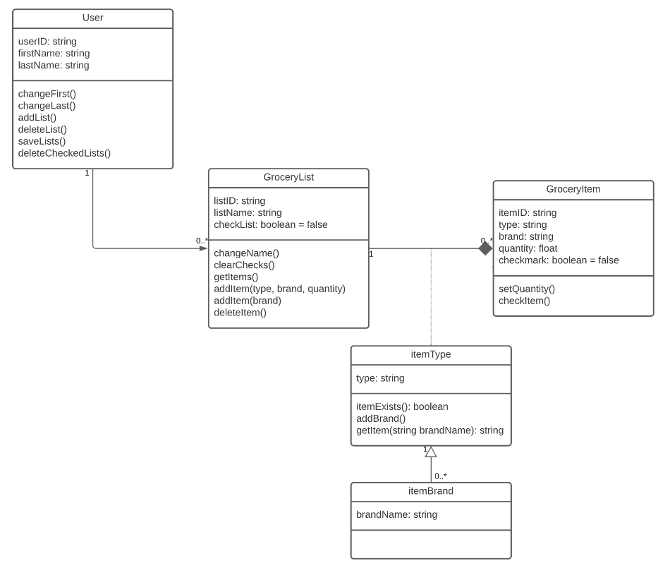
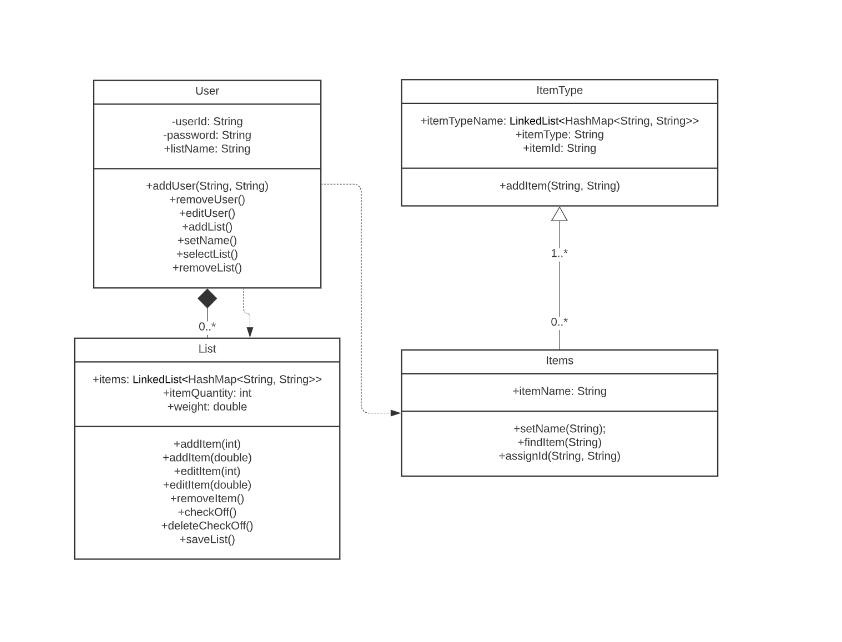
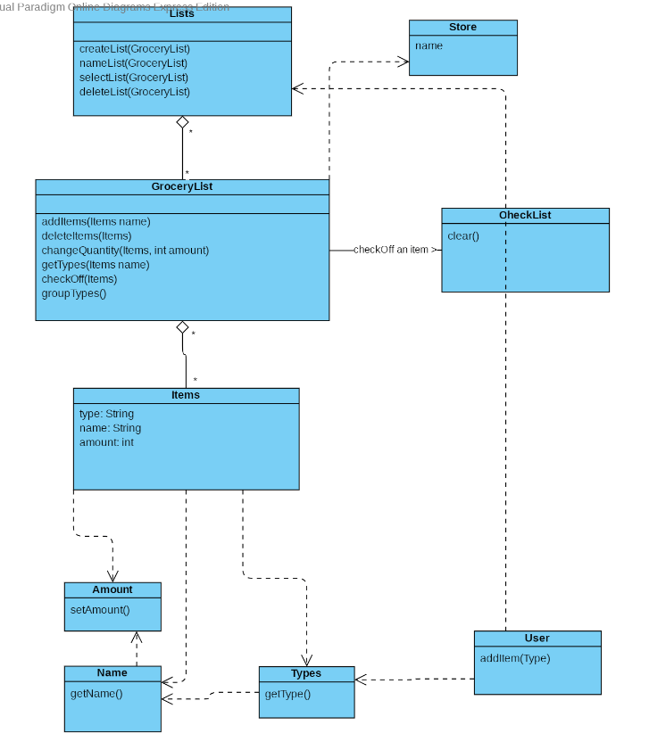
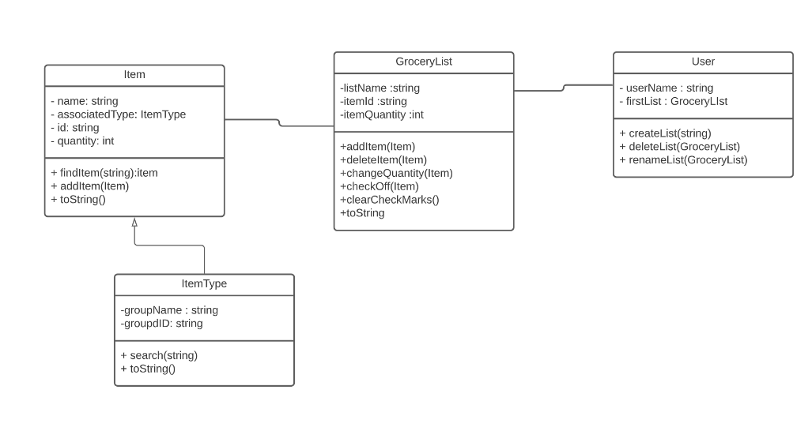
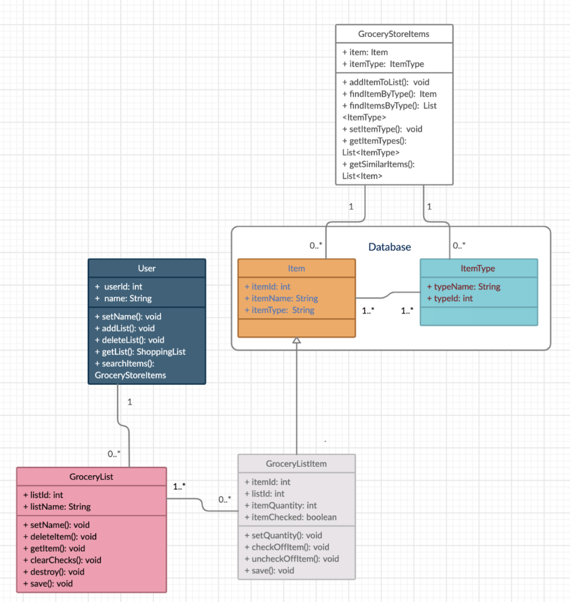
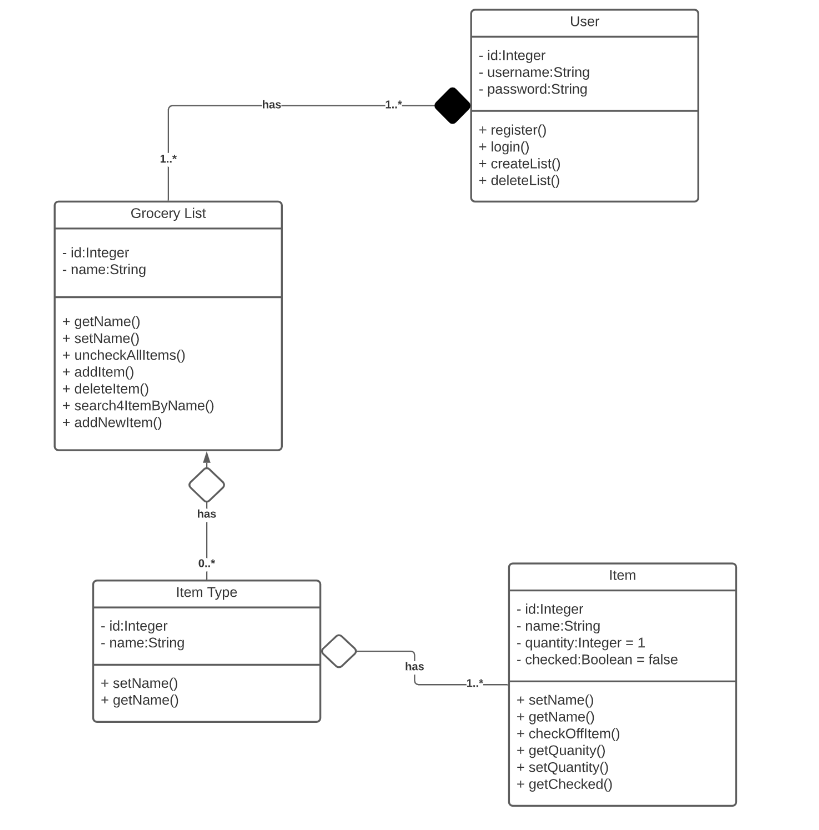
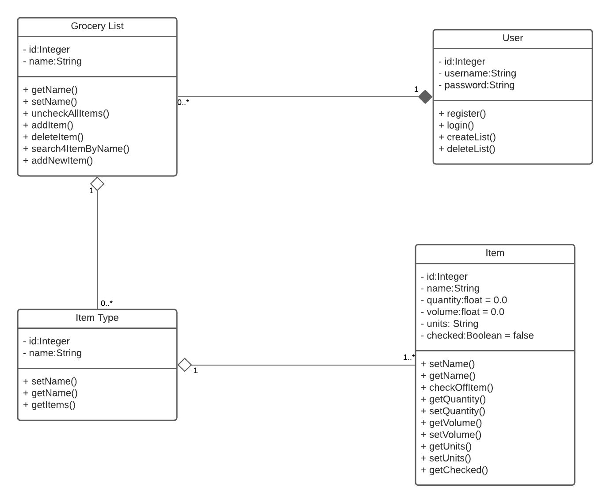


# Team 1: Design Discussion

## Part A

- Design 1 - Kevin
	- Pros: Very thorough with getters and setters, uses float with quantity to allow user to specify lb and oz, or kg
	- Cons: Relationship arrows have mistakes, no search function
	

- Design 2 - Abir
	- Pros: multiple ways to add items to list (by weight, quantity)
	- Cons: No composition from items to list

- Design 3 - Ilyun
	- Pros: Has the core functionality
	- Cons: confusing to understand

- Design 4 - Jamil
	- Pros: Simple, easy to understand
	- Cons: No relationship arrows and numbers, few get methods

- Design 5 - Ibrahim
	- Pros: Multiple ways to find items
	- Cons: No hierarchy containing item, itemtype

- Design 6 - Zain
	- Pros: Very clear, easy to understand
	- Cons: GroceryList to user should be 1..*(Lists) to 1(User), itemType should have a method to get all items associated with it

## Part B
Since we thought Zain's design was the closest to what we saw as a correct design, we went with it. One thing that we thought to take from all of the designs was the structure, where User was a composition of GroceryList, GroceryList was a composition of ItemType, and ItemType was a composition of Item. Compared to Kevin's design, the final design was more concise and had all the necesary methods for searching items. Abir's was a close second, but some of the Use arrows werent clear in their implemenation. Ilyun's desisn had much of the core functionality, but compared to the final design, it wasn't as easy to navigate and understand how everything connected. Jamil's was very easy to understand, however the use of aggregation and composition was something we thought necessary. Also, were something we thought the final design needed. Ibraham's design was very thorough, however we felt that we didnt need to model the database in the final design. We did like how there were different ways to get items by brand and by type. A difference from Ibraham's and the final design's implementation was the relationship between Item and ItemType. According to the assignment, were were to have a clear hierarchy between Item and ItemType. Zain's Design Was used in the end, where all we really had to do was add a method to fetch all items under a certain type, and add units for volume for things like milk and water. Also, we had to make sure the enumeration for each class was correct. We wanted one user to go to many GroceryLists, one GroceryList to go to many ItemTypes, and one ItemType to go to many Items. After making those changes, we thought that this final design was able to communicate our design choices properly.

## Part C

Aggregation and composition are important as they describe the relationships between classes. One of the main points discussed was the conciseness of each design, which is why Zain's was chosen. We wanted to make sure that every part of the design was useful, with no extra fluff. No design was wrong and they all made sense in some way, so we were able to modify Zain's design slightly by adding aspects of other designs. We understood that everybody had their opinions when it came to their individual designs, but through constructive conversion we were able to agree on a final design.

