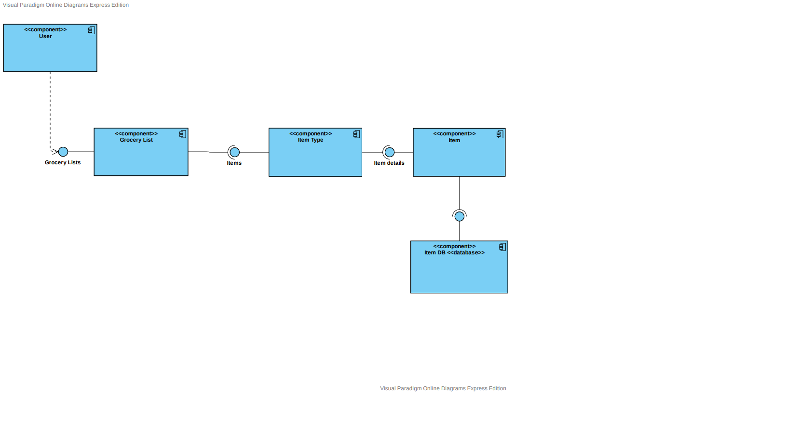
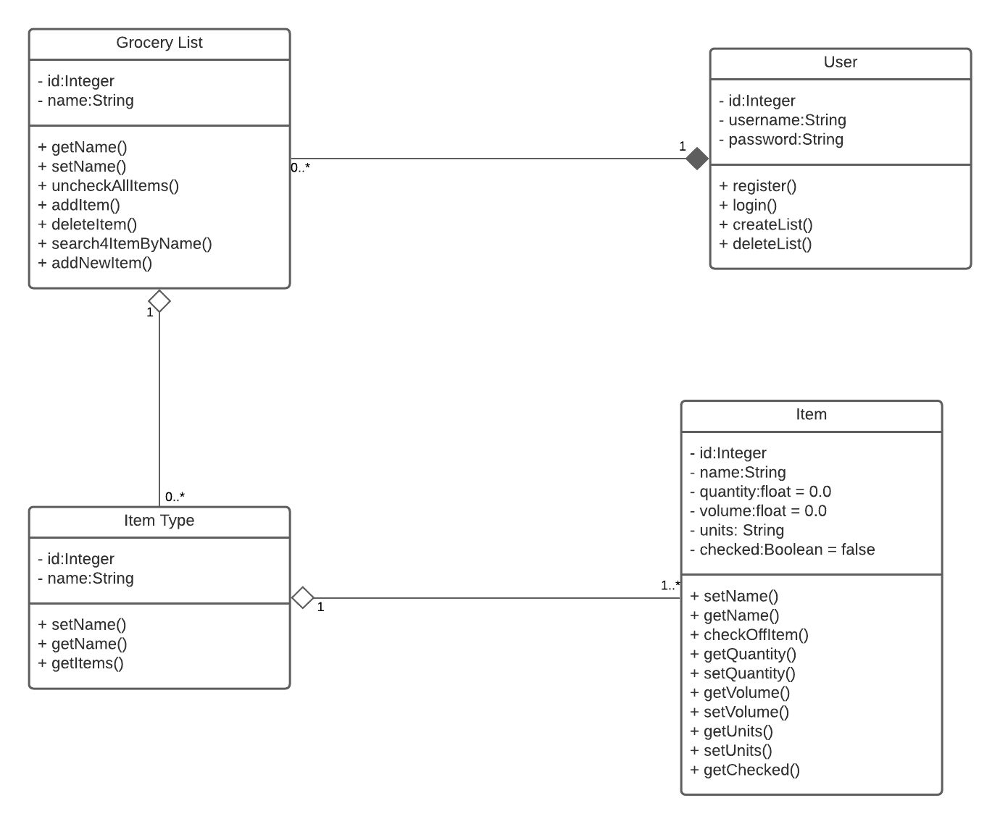
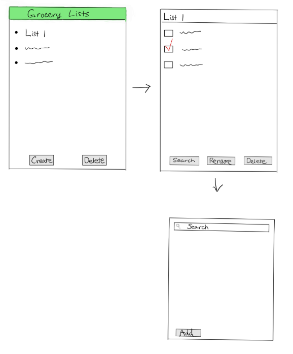

# Design Document

**Author**: Team 1

## 1 Design Considerations

### 1.1 Assumptions

 The target device for this application will be android mobile phones. The device's local database will be used to perform queries and data insertion on list items. Users will be expected to use the application in portrait mode.
### 1.2 Constraints

Login functionality requires additional database resources so we decided not to implement it. 

### 1.3 System Environment

The Minimum API level we will be supporting is 21 on android mobile devices. Anything lower than this API level will not be guaranteed to function properly.

## 2 Architectural Design

### 2.1 Component Diagram

### 2.2 Deployment Diagram

We deemed this diagram as unnecessary to the the fact that every resource will be contained on the local device. Since user login will not be implemented, the use of an external database for user verification will not be needed. If we were to make a diagram for deployed devices, it would only have one component to it.  

## 3 Low-Level Design

### 3.1 Class Diagram

## 4 User Interface Design

