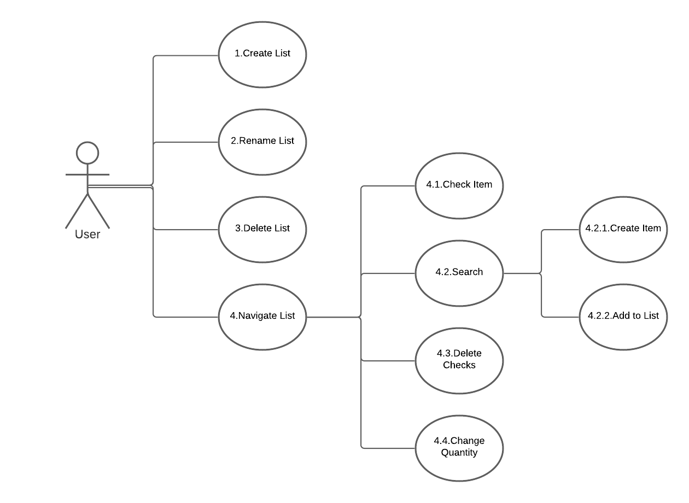

# Use Case Model

**Author**: Team 1 - Kevin Perez

## 1 Use Case Diagram

## 2 Use Case Descriptions

- Case 1: Create a List
    - Requirement: The user wants to create a list with a name they have chosen.
    - Pre-Condition: For a user to create a list, they must be on the first activity. Also, there must be less than 50 lists in existence. Finally, the name field for the list must not be empty.
    - Post-Condition: Once the user adds the list, the list must be added to the list containing grocery lists, with its name properly displayed.
    - Scenarios: Go to the main screen, click the Add-List button, input a name for the list, and finally, press the submit button.
    
- Case 2: Rename a List
    - Requirement: The user wants to rename an existent list with a name they decide.
    - Pre-Condition: They must be on the main activity, which shows all lists. The list to be renamed must exist on this main activity before the user can rename it. The field used to enter a new name must not be empty.
    - Post-Condition: The list must appear with its updated name after the user submits the name change.
    - Scenarios: On the main activity, holy down on the list you wish to rename. Select "Rename" from the popup list. Enter the name you wish to rename the list with and hit OK.
    
- Case 3: Delete a List
    - Requirement: The user wants to delete an existing list in the main activity.
    - Pre-Condition: The list the user wants to delete must exist and be displayed in the first activity.
    - Post-Condition: Once the user has confirmed the deletion of the selected list, the list must be removed from the list view, deleting the list and items that are in the list.
    - Scenarios: Go to the main screen, click and hold on the list you want to delete. Select "Delete List" and confirm your choice.
    
- Case 4: Navigate List
    - Requirement: The user wants to view the items that are contained in a certain list.
    - Pre-Condition: The list must exist and be displayed in the first activity so that it can be clicked on. 
    - Post-Condition: One the list is clicked on, the user will be navigated to a second activity which is a list on the screen that contains items that were added to the selected list. This activity can be empty if there are no items added to the list. There will be a button on the screen to add items to the list.
    - Scenarios: Starting on the primary activity, the user clicks on a list. This changes the screen to show the items in the selected list, with check boxes next to each item. There will also be a button to add items to the list
    
- Case 4.1: Check Item
    - Requirement: A user will be able to toggle items that are contained in a list by clicking on a check-box
    - Pre-Condition: The item the user wants to check-off is contained in the selected list. 
    - Post-Condition: Once the user clicks on the check box, it will check the box if it is not checked, and un-check the box if it is checked.
    - Scenarios: The user first selects a list from the main activity. Then, the user clicks on the check-boxes next to the items shown on the second activity they will be navigated to. The check box will toggle on or off once the user clicks it, depending on the box's current state.

- Case 4.2: Search Item
    - Requirement: The user must be able to press a button to bring up a search box and view what items are available from the database.
    - Pre-Condition: The user must have navigated into a list that has been created previously.
    - Post-Condition: After pressing the "search" button, a search box must pop up which allows the user to search for a specific item.
    - Scenarios: First starting on the main activity, the user clicks on a list, then clicks on the "search" button in the second activity.

- Case 4.3: Delete Checks
    - Requirement: The user wants to clear checks boxes for items contained in a selected list.
    - Pre-Condition: The list the user wants to clear the check boxes must exist, and the user must navigate to that list.
    - Post-Condition: Once the user clicks on the button the clear check marks for items in the list, each check-box should become unchecked, and each list should save.
    - Scenarios: The user starts at the main activity, and clicks on a list to navigate into it. After that, the user clicks on the "clear all" button which would clear all of the check marks in the current list.

- Case 4.4: Delete Item
    - Requirement: The user wants to remove an item in the current list. Once removed the item should no longer exist in that list.
    - Pre-Condition: The item must exist within the selected list.
    - Post-Condition: Once the user confirms the removal of the item in the list, the item should dispensary from the list.
    - Scenarios: The user first selects a list in the main activity and navigates into it. Then, the user hold down on an item until a prompt pops up. The user clicks on "remove item", the clicks "ok" on the confirmation prompt, removing the list.

- Case 4.5: Change Quantity
    - Requirement: The user will be able to change the quantity in an item they choose.
    - Pre-Condition: The item must exist within the selected list.
    - Post-Condition: Once the user confirms their changes, the text displaying quantity and units must update on the screen.
    - Scenarios: The user starts on the main screen, then selects a list to navigate to. Once that list is selected, the user will click and hold on an item, where a prompt will pop up. From the prompt, the user will select "edit", and be able to change the units and value of the current item. Once confirmed with the "ok" button, the item will be updated with the new value and unit.

- Case 4.2.1: Add Item
    - Requirement: After searching for an item, the user will be able to add it to the list.
    - Pre-Condition: The user must have navigated to a list, and clicked the "search" button. This will bring up a search box to begin looking for items. Then, the user must select an item, enter values for quantity, and click "add".
    - Post-Condition: After the user clicks "add", the list must contain the new item, with the quantity and units filled out as the user requested.
    - Scenarios: The user starts on the first activity, clicks on a list, then clicks on the search button. The search button brings up a search box, where the user can put in a brand name or item type to look for an item. A list of items will appear, and the user can select one to add to the list.

- Case 4.2.2: Create Item
    - Requirement: The user must be able to add a custom item to the database and list that did not show up in the search.
    - Pre-Condition:The user must have searched for an item in the second activity, with the item not appearing in the database.
    - Post-Condition: After the user specifies the item's type, brand, and quantity, the item will be added first to the database, and then to the current list they are on. The item will have appropriate units and quantity as the user has specified.
    - Scenarios: The user starts on the main activity, then clicks on a list. From there, they click the search button, which brings up a box where they can enter product types and brands. If nothing shows up, and the user click the "create item" button, a small form asking for the item type, brand, quantity, and units will show. After accepting the addition of the new item, it will show up on the new list.

    
